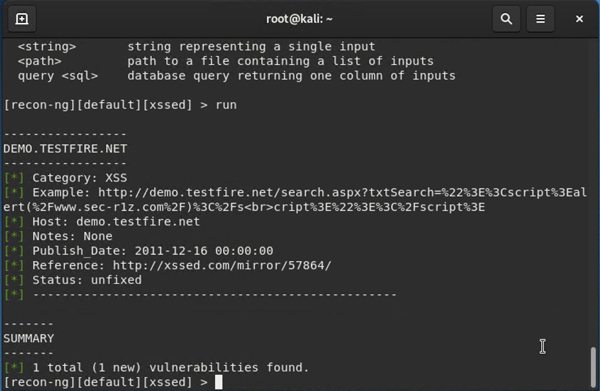
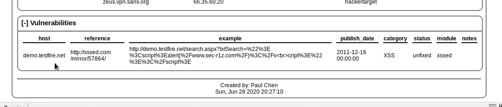

## Week 16 Homework Submission File: Penetration Testing 1

#### Step 1: Google Dorking

- Using Google, can you identify who the Chief Executive Officer of Altoro Mutual is:
  - **Karl Fitzgerald**

- How can this information be helpful to an attacker:
  - **A whaling attack, also known as whaling phishing or a whaling phishing attack, is a specific type of phishing attack that targets high-profile employees, such as the CEO or CFO, in order to steal sensitive information from a company, as those that hold higher positions within the company typically have complete access to sensitive data.**

#### Step 2: DNS and Domain Discovery

Enter the IP address for `demo.testfire.net` into Domain Dossier and answer the following questions based on the results:

  1. Where is the company located:
    - **Sunnyvale, California**
  2. What is the NetRange IP address:
    - **65.61.137.64 - 65.61.137.127**
  3. What is the company they use to store their infrastructure:
    - **Rackspace Backbone Engineering**
  4. What is the IP address of the DNS server:
    - **65.61.137.117**
    
#### Step 3: Shodan

- What open ports and running services did Shodan find:
  - **tcp 80, http**
  - **tcp 443, https**
  - **tcp 8080, http**
  - **tcp 8443, https**

#### Step 4: Recon-ng

- Install the Recon module `xssed`. 
- Set the source to `demo.testfire.net`. 
- Run the module. 

- **> marketplace search xssed**
- **> marketplace install xssed**
- **> modules load recon/domains-vulnerabilitites/xssed**
- **> options set SOURCE demo.testfire.net**
- **> run**

Is Altoro Mutual vulnerable to XSS:

### Step 5: Zenmap

Your client has asked that you help identify any vulnerabilities with their file-sharing server. Using the Metasploitable machine to act as your client's server, complete the following:

- Command for Zenmap to run a service scan against the Metasploitable machine:
  - **nmap -sV 192.168.0.10**
 
- Bonus command to output results into a new text file named `zenmapscan.txt`:
  - **nmap -sV -oN zenmapscan.txt 192.168.0.10 

- Zenmap vulnerability script command: 

- Once you have identified this vulnerability, answer the following questions for your client:
  1. What is the vulnerability:
    - **Message signing disabled**

  2. Why is it dangerous:
    - **SMB signing allows the recipient of SMB packets to confirm their authenticity and helps prevent man in the middle attacks against SMB.**

  3. What mitigation strategies can you recommendations for the client to protect their server:
    - **enable smb signing**

---
© 2020 Trilogy Education Services, a 2U, Inc. brand. All Rights Reserved.  

