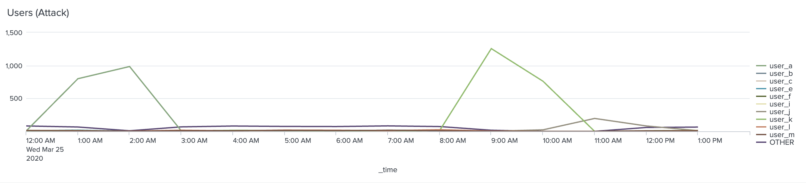
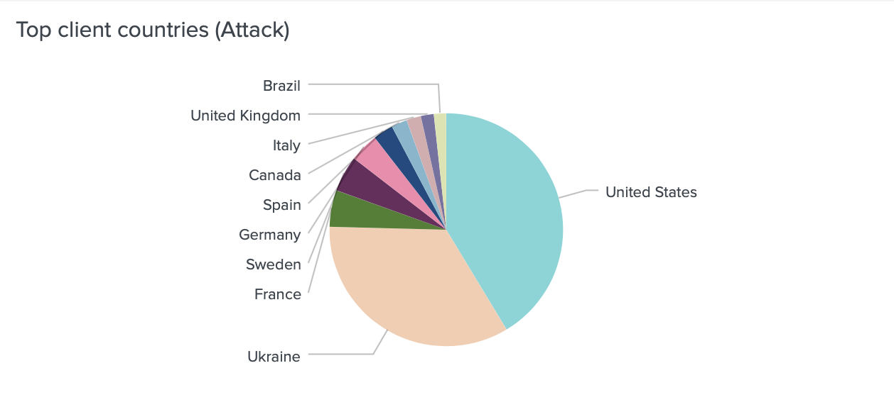
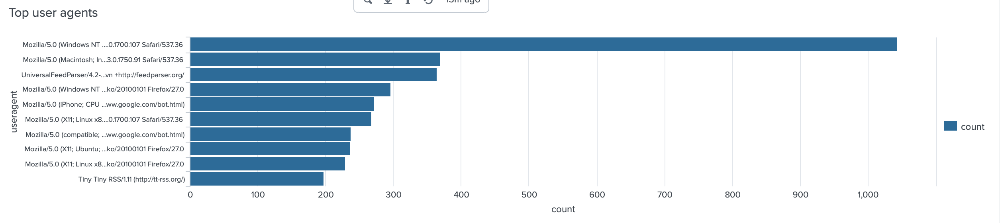

## Unit 19 Homework: Protecting VSI from Future Attacks

### Scenario

In the previous class,  you set up your SOC and monitored attacks from JobeCorp. Now, you will need to design mitigation strategies to protect VSI from future attacks. 

You are tasked with using your findings from the Master of SOC activity to answer questions about mitigation strategies.

### System Requirements 

You will be using the Splunk app located in the Ubuntu VM.

### Logs

Use the same log files you used during the Master of SOC activity:

- [Windows Logs](resources/windows_server_logs.csv)
- [Windows Attack Logs](resources/windows_server_attack_logs.csv)
- [Apache Webserver Logs](resources/apache_logs.txt	)
- [Apache Webserver Attack Logs](resources/apache_attack_logs.txt	)

---

### Part 1: Windows Server Attack

 
#### Question 1
- Several users were impacted during the attack on March 25th.

  - **ANSWER: user_a and user_k**
- Based on the attack signatures, what mitigations would you recommend to protect each user account? Provide global mitigations that the whole company can use and individual mitigations that are specific to each user.

  - **ANSWER:**
    - **user account log out:**
    - **For advanced users who want to protect their accounts from attack, give them the option to allow login only from certain IP addresses.**
    - **Assign unique login URLs to blocks of users so that not all users can access the site from the same URL.**
    - **Use a CAPTCHA to prevent automated attacks.**
    - **Instead of completely locking out an account, place it in a lockdown mode with limited capabilities.**
    
#### Question 2
- VSI has insider information that JobeCorp attempted to target users by sending "Bad Logins" to lock out every user.
- What sort of mitigation could you use to protect against this?
  - **ANSWER**
  - **For advanced users who want to protect their accounts from attack, give them the option to allow login only from certain IP addresses.**
  - **Assign unique login URLs to blocks of users so that not all users can access the site from the same URL.**
  - **Use a CAPTCHA to prevent automated attacks.**
  - **Instead of completely locking out an account, place it in a lockdown mode with limited capabilities.**
  

### Part 2: Apache Webserver Attack:
 
#### Question 1
- Based on the geographic map, recommend a firewall rule that the networking team should implement.
- Provide a "plain english" description of the rule.
  - For example: "Block all incoming HTTP traffic where the source IP comes from the city of Los Angeles."
- Provide a screen shot of the geographic map that justifies why you created this rule.

  
#### Question 2

- VSI has insider information that JobeCorp will launch the same webserver attack but use a different IP each time in order to avoid being stopped by the rule you just created.

- What other rules can you create to protect VSI from attacks against your webserver?
  - Conceive of two more rules in "plain english". 
  - Hint: Look for other fields that indicate the attacker.
  
  

