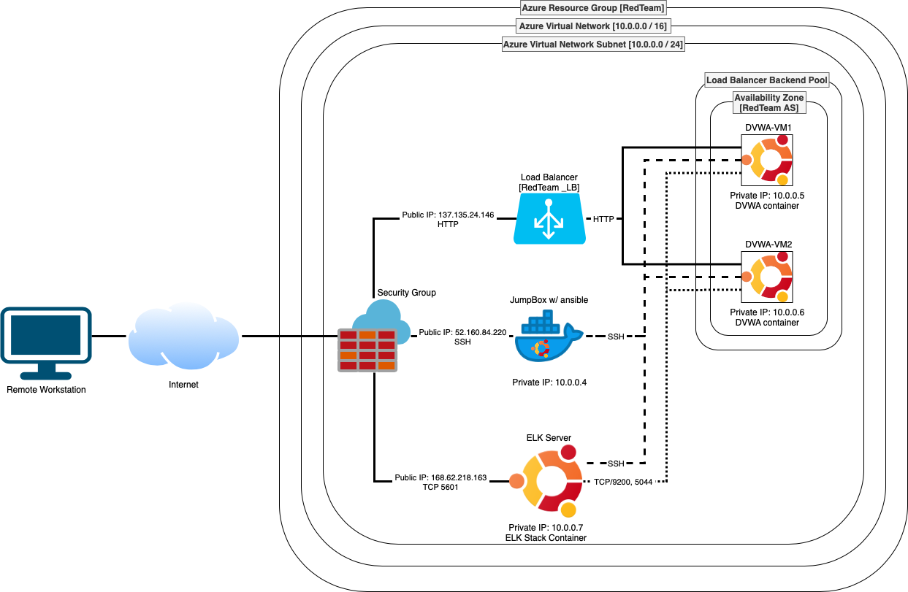
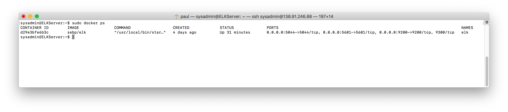

## Automated ELK Stack Deployment

The files in this repository were used to configure the network depicted below.

These files have been tested and used to generate a live ELK deployment on Azure. They can be used to either recreate the entire deployment pictured above. Alternatively, select portions of the playbook file may be used to install only certain pieces of it, such as Filebeat.

  - [elk-playbook](resources/elk-playbook.yml)
  - [filebeat-config](resources/filebeat-config.yml)
  - [filebeat-playbook](resources/filebeat-playbook.yml)
  - [metricbeat-config](resources/metricbeat-config.yml)
  - [metricbeat-playbook](resources/metricbeat-playbook.yml)

This document contains the following details:
- Description of the Topology
- Access Policies
- ELK Configuration
  - Beats in Use
  - Machines Being Monitored
- How to Use the Ansible Build

### Description of the Topology

The main purpose of this network is to expose a load-balanced and monitored instance of DVWA, the Damn Vulnerable Web Application.

Load balancing ensures that the application will be highly **available**, in addition to restricting **access** to the network.
- **Load Balancing plays an important security role as computing moves evermore to the cloud. The off-loading function of a load balancer defends an organization against distributed denial-of-service (DDoS) attacks. It does this by shifting attack traffic from the corporate server to a public cloud provider.**
- **The advanatage of jump box are it controls access to the other machines by focusing on the interactions between the routers instead of all of the machines, we only have to worry about a few connections between a few machines, rather than connections between all machines. Therefore, it reduces the attack surface and segregates the other machines from exposing to the public network.**

Integrating an ELK server allows users to easily monitor the vulnerable VMs for changes to the **file system** and system **metrics**.
- **Filebeat monitors the log files or locations that you specify, collects log events, and forwards them either to Elasticsearch or Logstash for indexing.**
- **Metricbeat is a lightweight shipper that you can install on your servers to periodically collect metrics from the operating system and from services running on the server.**

The configuration details of each machine may be found below.

| Name       | Function          | IP Address | Operating System       |
|------------|-------------------|------------|------------------------|
| Jump Box   | Gateway           | 10.0.0.4   | Ubuntu Linux 18.04 LTS |
| DVWA-VM1   | Web Application   | 10.0.0.5   | Ubuntu Linux 18.04 LTS |
| DVWA-VM2   | Web Application   | 10.0.0.6   | Ubuntu Linux 18.04 LTS |
| ELK Server | System Monitoring | 10.0.0.7   | Ubuntu Linux 18.04 LTS |

### Access Policies

The machines on the internal network are not exposed to the public Internet. 

Only the **Jump Box** machine can accept connections from the Internet. Access to this machine is only allowed from the following IP addresses:
- **174.65.148.43**

Machines within the network can only be accessed by **Jump Box**.
- **Remote Machine (174.65.148.43) are allow to access the ELK VM's kibana interface (TCP 5601)**

A summary of the access policies in place can be found in the table below.

| Name       | Publicly Accessible | Allowed IP Addresses    |
|------------|---------------------|-------------------------|
| Jump Box   | Yes                 | 174.65.148.43 (SSH)     |
| DVWA-VM1   | No                  |                         |
| DVWA-VM2   | No                  |                         |
| ELK Server | Yes                 | 174.65.148.43 (TCP 5601)|

### Elk Configuration

Ansible was used to automate configuration of the ELK machine. No configuration was performed manually, which is advantageous because...
- **It ensures the provisioning scripts run identically everywhere they use them. All the configurations will dop exactly the same thing everytime we run them, by eliminating as mucb variablity between configurations as possibe.**

The playbook implements the following tasks:
- **increase virtual memory**
- **install docker.io engine, python-pip, docker module**
- **download and launch a docker elk container (sepb/elk) with open ports 5601, 9200, 5044**

The following screenshot displays the result of running `docker ps` after successfully configuring the ELK instance.

### Target Machines & Beats
This ELK server is configured to monitor the following machines:
- **DVWA-VM1 (10.0.0.5)**
- **DVWA-VM2 (10.0.0.6)**

We have installed the following Beats on these machines:
- **FileBeat**
- **MetricBeat**

These Beats allow us to collect the following information from each machine:
- _TODO: In 1-2 sentences, explain what kind of data each beat collects, and provide 1 example of what you expect to see. E.g., `Winlogbeat` collects Windows logs, which we use to track user logon events, etc._
- **Filebeat collects system log events, which we use to track user login events (e.g. SSH login attempts)**
- **Metricbeat collect metrics from the operating system and from services running on the server, which we used to track**

### Using the Playbook
In order to use the playbook, you will need to have an Ansible control node already configured. Assuming you have such a control node provisioned: 

SSH into the control node and follow the steps below:
- Copy the **configuration** file to **/etc/ansible**.
- Update the **configuration** file to include **elk server ip address**
- Run the playbook, and navigate to **Kibana dashboard** to check that the installation worked as expected.

- **elk-playbook.yml, filebeat-playbook.yml, metricbeat-playbook.yml are the playbook and they are located at /etc/ansible**
- _Which file do you update to make Ansible run the playbook on a specific machine? How do I specify which machine to install the ELK server on versus which to install Filebeat on?_
- _Which URL do you navigate to in order to check that the ELK server is running?

_As a **Bonus**, provide the specific commands the user will need to run to download the playbook, update the files, etc._
