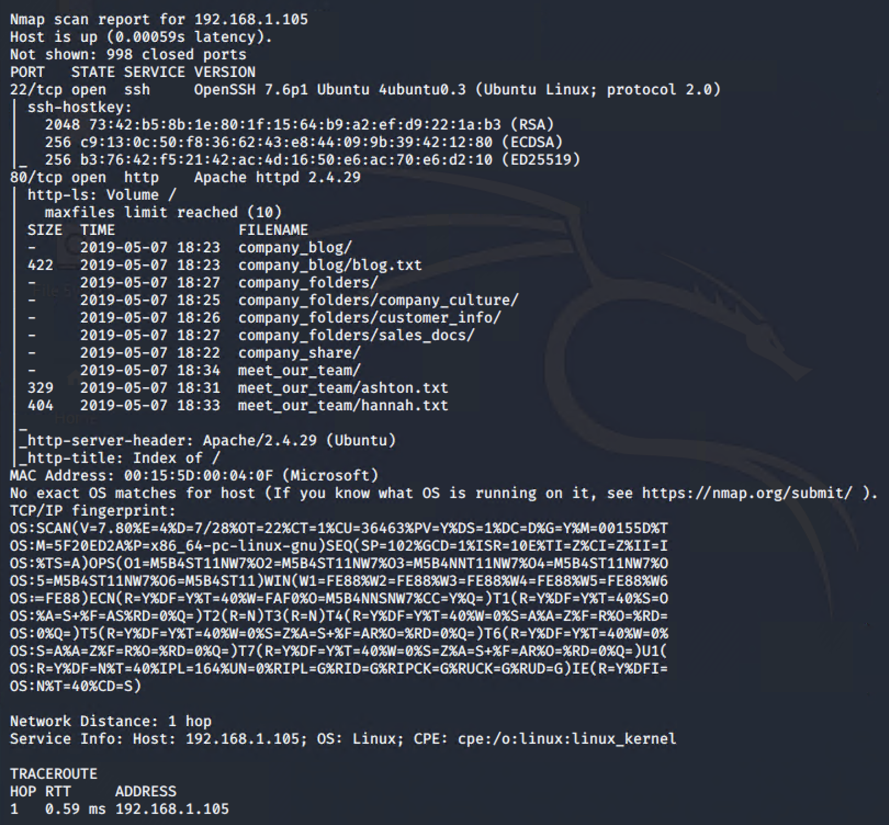

### Instructions

Complete the following to find the flag:

- Discover the IP address of the Linux web server.
  - **Answer**: '> nmap -A 192.168.1.1/24'
  - 
  
- Locate the hidden directory on the web server.
  - **Answer**: 'By browsing the website http://192.168.1.105, we found there is a hidden folder inside company_folders that requires authentication'
  - 
  - 

- Brute force the password for the hidden directory using the hydra command:
    - **Answer**: `hydra -l ashton -P /usr/share/wordlists/rockyou.txt -s 80 -f -vV 192.168.1.105 http-get /company_folders/secret_folder`
    - 
    - 
    - 
    
- Break the hashed password with the Crack Station website or John the Ripper.
- Connect to the server via WebDav.
    - **Answer**: Using cadaver to connect to the webdav folder
    - 
    
- Upload a PHP reverse shell payload.
  - generate the payload by msfvenom
  - 
  
  - Use cadaver again to put the payload to the webdav folder
  - 
  - 
  
- Execute payload that you uploaded to the site to open up a meterpreter session.
  - 
  - 
- Find and capture the flag.
  - 
