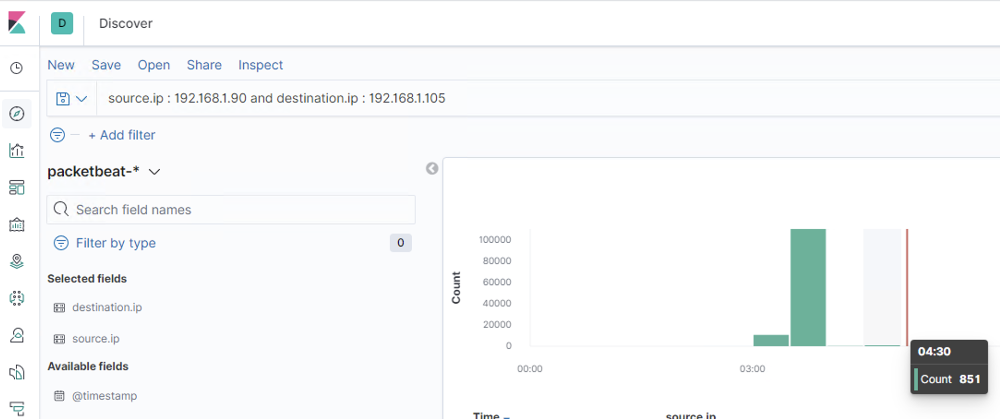
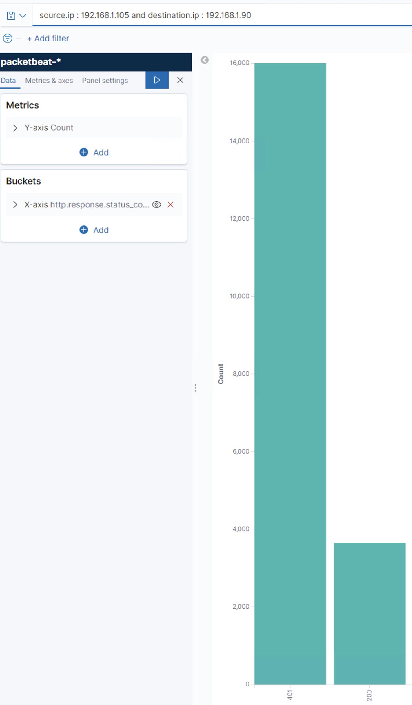
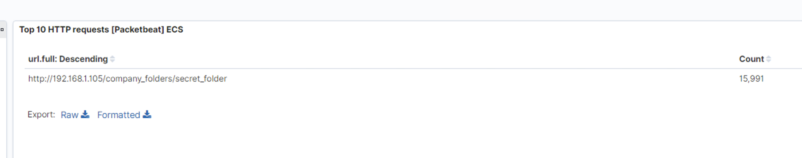
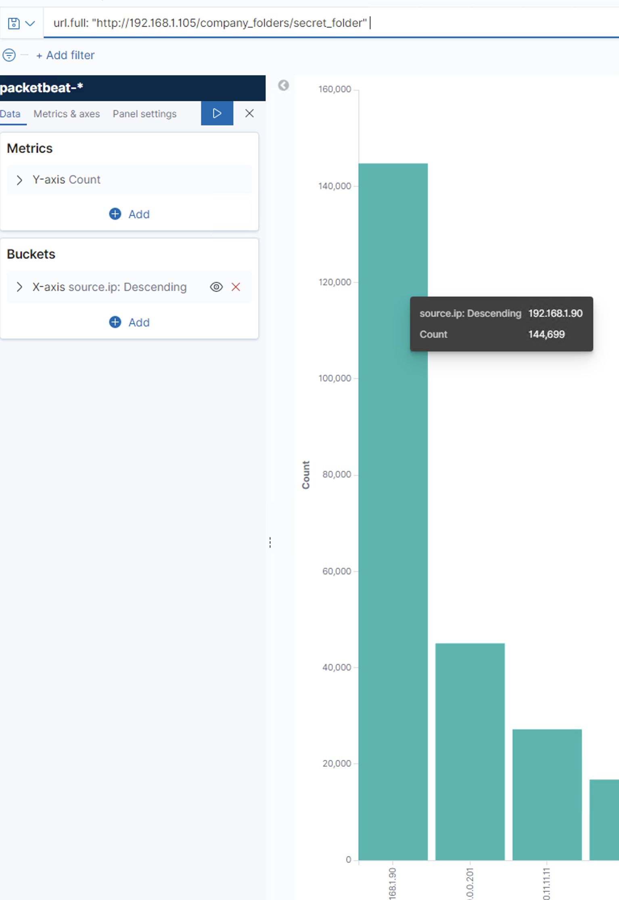
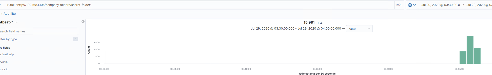
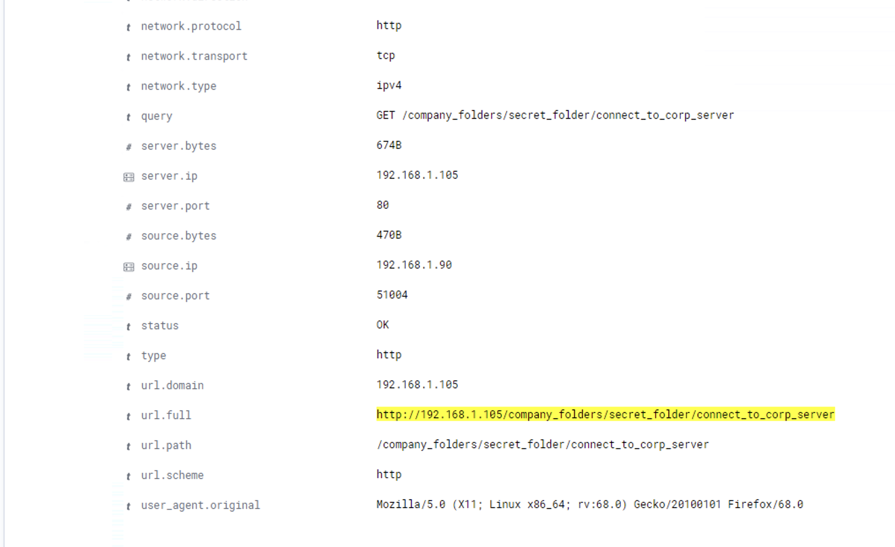
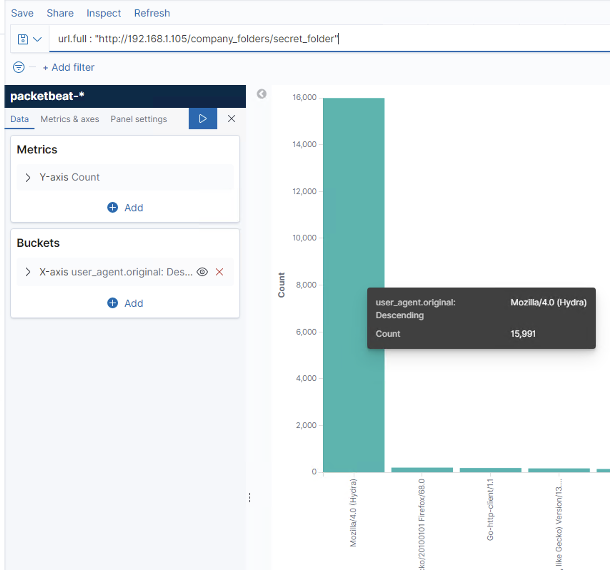
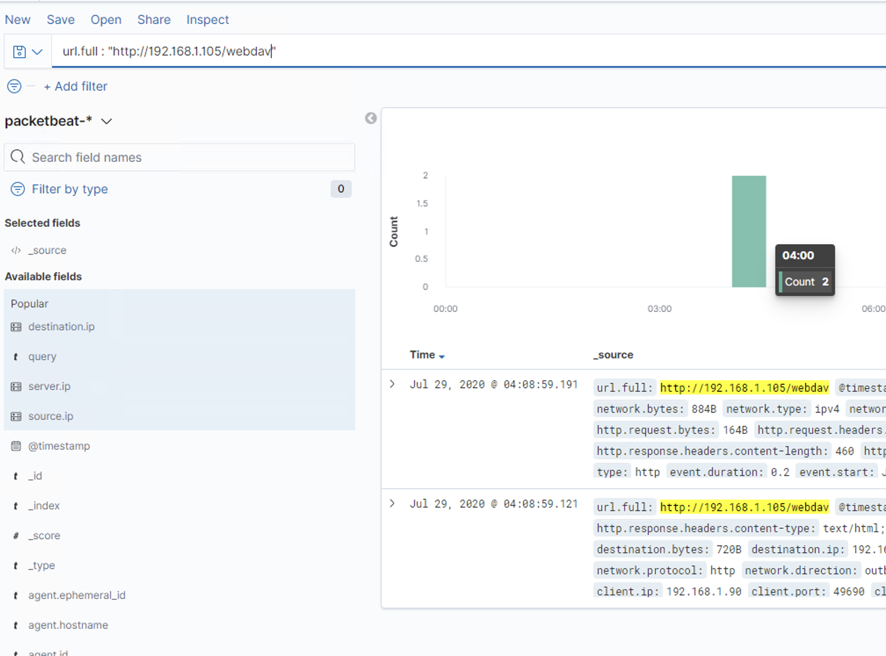
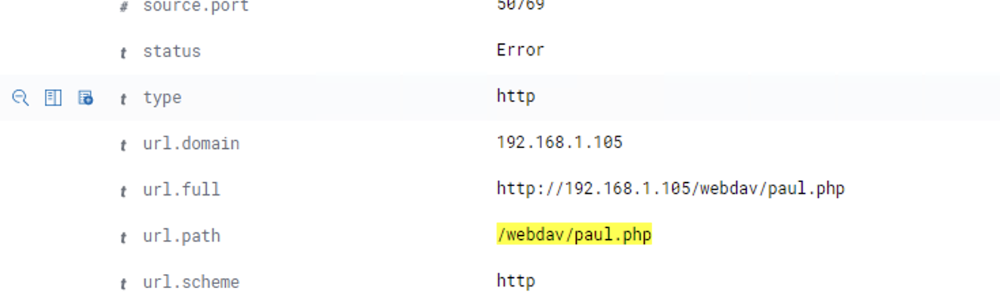

1. Identify the offensive traffic.
   - Identify the traffic between your machine and the web machine:
     - When did the interaction occur?
       - **ANSWER: Between 3:00 am to 4:30 am on July 29, 2020**
       - 
     - What responses did the victim send back?
       - **ANSWER: HTTP response code 401**
       - 
     - What data is concerning from the Blue Team perspective?
       - **ANSWER: There is a user agent cadaver to use a put method which is not normal for webserver. Also, paul.php is a reverse shell php.**

2. Find the request for the hidden directory.
   - In your attack, you found a secret folder. Let's look at that interaction between these two machines.
     - How many requests were made to this directory? At what time and from which IP address(es)?
       - **ANSWER: There were 144,699 requests to this directory from ip address 192.168.1.90 from 3:55 am to 3:56 am **
       - 
       - 
       - 
     - Which files were requested? What information did they contain?
       - **ANSWER: it contains file connect_to_corp_server which has the hash for ryan password**
       - 
     - What kind of alarm would you set to detect this behavior in the future?
       - **ASNWER: We can set an alarm for http.response.status.code for 401 to avoid this type of brute force attack**
     - Identify at least one way to harden the vulnerable machine that would mitigate this attack.
       - **ANSWER: Account lockout, Multiple factor Authentication, Captcha**

3. Identify the brute force attack.
   - After identifying the hidden directory, you used Hydra to brute-force the target server. Answer the following questions:
     - Can you identify packets specifically from Hydra?
       - **ANSWER: By searching user_agent.original of Mozilla/4.0 (Hydra)**
       - 
     - How many requests were made in the brute-force attack?
       - **ANSWER: 15991**
     - How many requests had the attacker made before discovering the correct password in this one?
       - **ANSWER: 15990**
     - What kind of alarm would you set to detect this behavior in the future and at what threshold(s)?
       - **by detecting user_agent.original equal to Mozilla/4.0 (Hydra)**
     - Identify at least one way to harden the vulnerable machine that would mitigate this attack.
       - **block user agent, use of user certificate instead of password**

4. Find the WebDav connection.
   - Use your dashboard to answer the following questions:
     - How many requests were made to this directory?
       - **ANSWER: 2**
       - 
     - Which file(s) were requested?
       - 
     - What kind of alarm would you set to detect such access in the future?
     - Identify at least one way to harden the vulnerable machine that would mitigate this attack.

5. Identify the reverse shell and meterpreter traffic.
   - To finish off the attack, you uploaded a PHP reverse shell and started a meterpreter shell session. Answer the following questions:
     - Can you identify traffic from the meterpreter session?
     - What kinds of alarms would you set to detect this behavior in the future?
     - Identify at least one way to harden the vulnerable machine that would mitigate this attack.

---
© 2020 Trilogy Education Services, a 2U, Inc. brand. All Rights Reserved.
